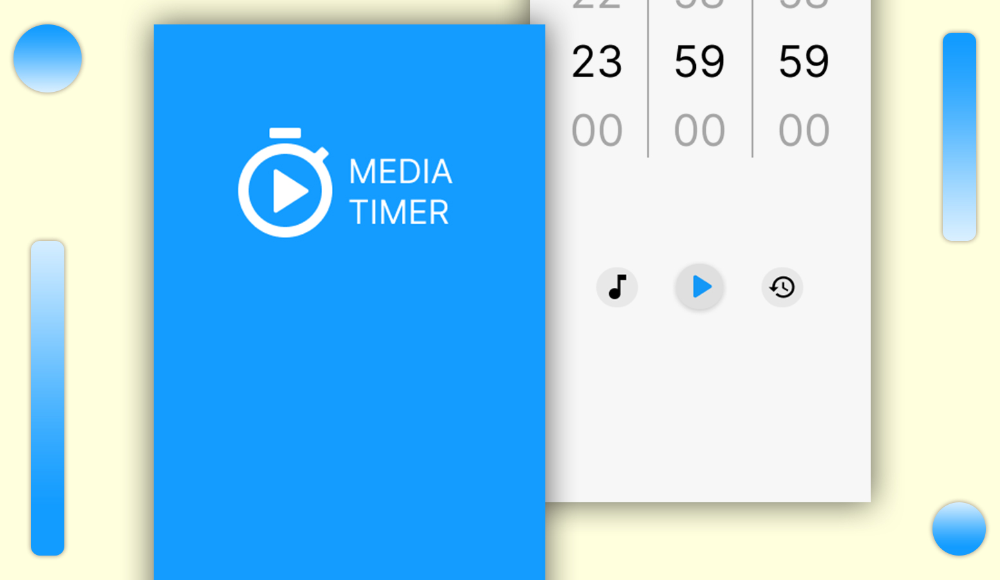
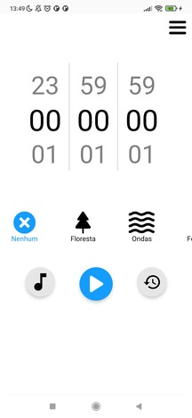

# MediaTimer

Aplicativo de timer de tempo com API de músicas, usando React Native para criação e com objetivo de solucionar um problema pessoal! (em progresso)

⚠️ Lembrando, é apenas um projeto pessoal e não será disponibilizado em nenhuma loja (por conta de direitos autorais)

## Conteúdos

- [Sobre](#Sobre)
  - [Screenshot](#screenshot)
  - [O que aprendi?](#O-que-aprendi?)
  - [O que busco no futuro?](#O-que-busco-no-futuro?)
  - [Demonstração](#demonstração)
  - [Links](#links)
  - [Tecnologias usadas](#Tecnologias-usadas)

## Sobre

### Screenshot

### O que aprendi?

 ( Área que irei escrever quando terminar o projeto )

### O que busco no futuro?

  ( Área que irei escrever quando terminar o projeto )

### Demonstração Android

- Baixar demonstração atual: [clique aqui](https://expo.dev/accounts/henriqueam/projects/media-timer/builds/0b869dbe-79cd-4121-935b-3f3f93356e98).

📙 Passo a passo 📙
- Entre no link pelo celular
- Clique em install e fazer o download do arquivo
- Clique em abrir e instalar
- Caso aparecer app de risco bloqueado, clique em mais detalhes e instalar assim mesmo.
- Por fim abra o aplicativo!

### Links

- Design no Figma: [clique aqui](https://www.figma.com/file/XTRDCbSVe8lHtwkXK1Z5T7/Media-Timer?type=design&node-id=0%3A1&t=I2CeKk7yJGLngWCy-1).

- Portfólio: [clique aqui](https://henriqueamascarin.vercel.app).

- Trello do projeto: [clique aqui](https://trello.com/b/qz6KPuiC/mediatimer)

### Tecnologias usadas

- React Native
- React Native Async Storage
- React Native Background Timer
- React Native Animated 
- React SVG + SVG Transformer
- React Native Dotenv
- Expo
- Expo AV
- Expo File System
- Axios
- Typescript
- Redux
- Notifee
