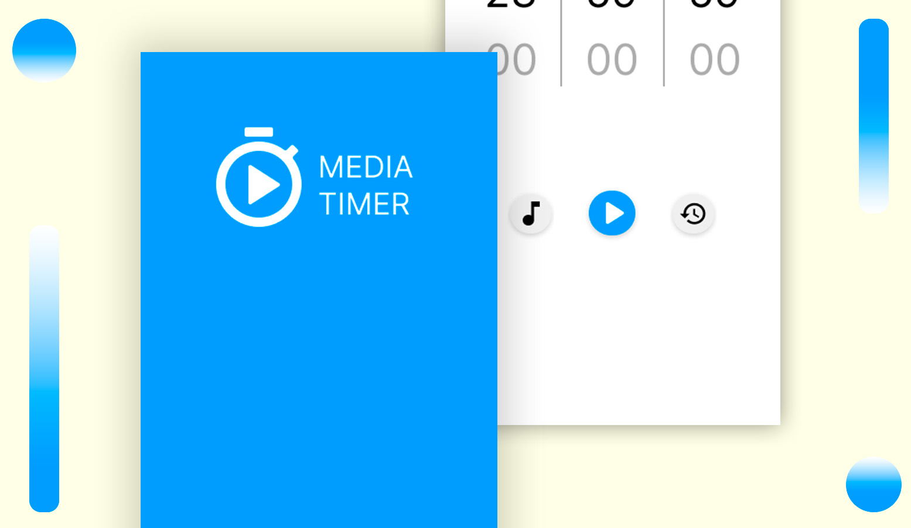

# MediaTimer

Aplicativo de timer de tempo com API de músicas, usando React Native para criação e com objetivo de solucionar um problema pessoal! (em progresso)

## Conteúdos

- [Sobre](#Sobre)
  - [Screenshot](#screenshot)
  - [O que aprendi?](#O-que-aprendi?)
  - [O que busco no futuro?](#O-que-busco-no-futuro?)
  - [O que falta no projeto?](#O-que-falta-no-projeto?)
  - [Links](#links)
  - [Tecnologias usadas](#Tecnologias-usadas)
  - [Futuras tecnologias](#Futuras-tecnologias)

## Sobre

### Screenshot

### O que aprendi?

 ( Área que irei escrever quando terminar o projeto )

### O que busco no futuro?

  ( Área que irei escrever quando terminar o projeto )

### O que falta no projeto?

- Algumas tecnologias.
- Funcionalidade de músicas (API).
- Tema branco e preto igual ao design.
- Melhorias.

### Links

- Baixar demonstração atual: [clique aqui]().

- Design no Figma: [clique aqui](https://www.figma.com/file/XTRDCbSVe8lHtwkXK1Z5T7/Media-Timer?type=design&node-id=0%3A1&t=I2CeKk7yJGLngWCy-1).

- Portfólio: [clique aqui](https://henriqueamascarin.vercel.app).

### Tecnologias usadas

- React Native
- Expo
- React Native Animated 
- React Pixel Ratio para criar uma responsividade com o tamanho de fonte do celular
- React Context API
- React SVG + SVG Transformer
- Typescript

### Futuras tecnologias

- Redux
- GraphQL
- API de músicas
- Jest para testes
