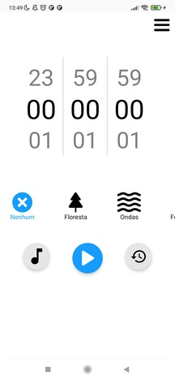

# Media Timer

Aplicativo de timer com sons e diversas funcionalidades, com objetivo de solucionar um problema pessoal!

## Conteúdos

- [Sobre](#Sobre)
  - [Screenshot](#screenshot)
  - [Demonstração](#demonstração)
  - [Links](#links)
  - [Tecnologias usadas](#Tecnologias-usadas)

## Sobre

### Screenshot

### Demonstração

- Baixar aplicativo: [clique aqui](https://play.google.com/store/apps/details?id=com.henriqueamascarin.mediatimer).

📙 Passo a passo 📙

- Entre no link pelo celular
- Clique em "Baixe o aplicativo" e espere baixar
- Clique em abrir e instalar
- Caso aparecer app de risco bloqueado, clique em mais detalhes e instalar assim mesmo.
- Por fim abra o aplicativo!

### Links

- Design no Figma: [clique aqui](https://www.figma.com/file/XTRDCbSVe8lHtwkXK1Z5T7/Media-Timer?type=design&node-id=0%3A1&t=I2CeKk7yJGLngWCy-1).

- Portfólio: [clique aqui](https://henriqueamascarin.vercel.app).

- Trello do projeto: [clique aqui](https://trello.com/b/qz6KPuiC/mediatimer)

### Tecnologias usadas

- React Native
- React Native Async Storage
- React Native Nitro BG Timer
- React Native Nitro Modules
- React Native Blob Util
- React Native Animated
- React SVG + SVG Transformer
- React Native Dotenv
- Expo
- Expo audio
- Expo File System
- Axios
- Typescript
- Redux
- Notifee
